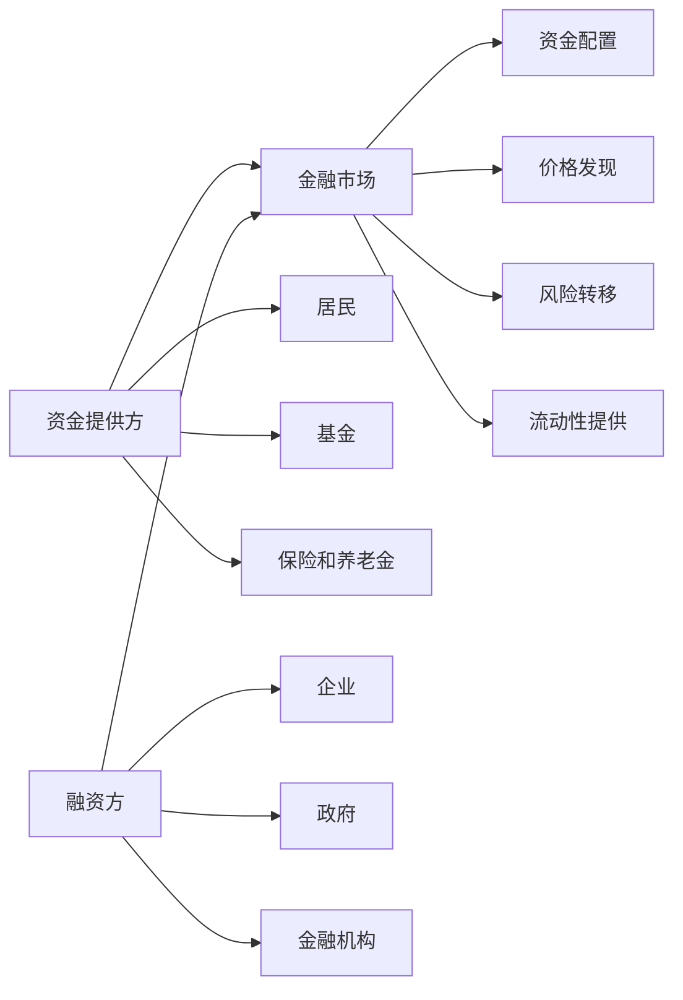
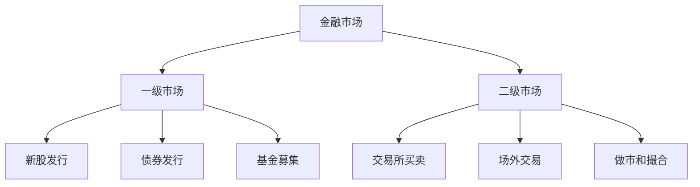
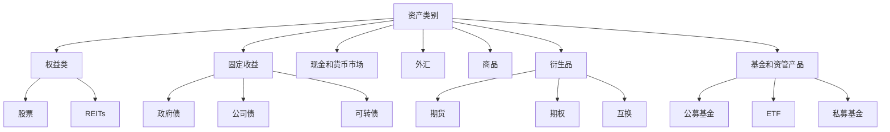
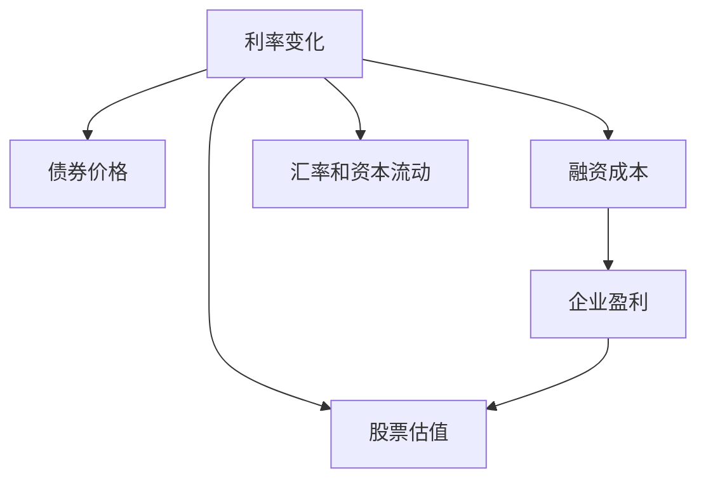
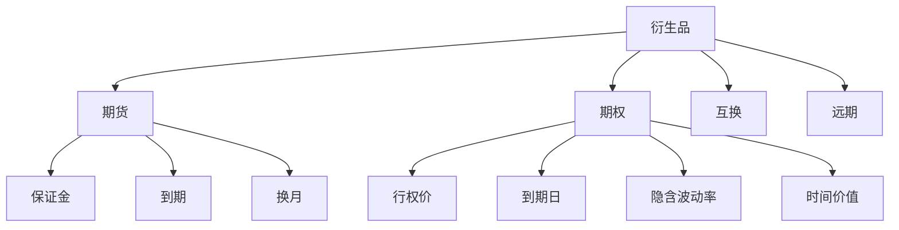
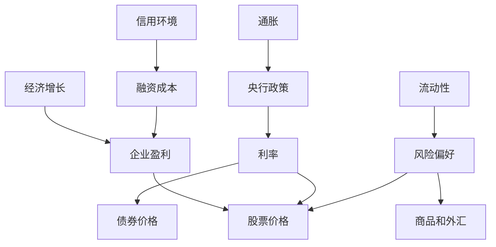
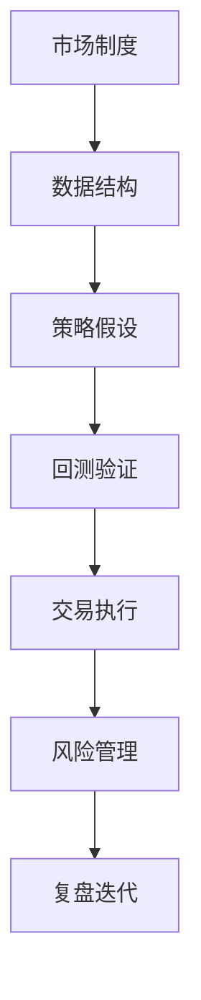

# 01 - 金融市场基础

本章目标：建立一张金融市场全景图。读完后，你应该能把股票、债券、外汇、商品、衍生品、基金、利率、信用、清算结算和市场周期放在同一个框架里理解。

金融市场不是一组孤立的价格走势图，而是一套连接融资、投资、风险转移、价格发现和资源配置的系统。

## 1. 金融市场为什么存在

金融市场解决三个基本问题：

1. **资金从哪里来，到哪里去**：企业、政府和金融机构需要资金，居民、基金、保险、养老金等持有资金。
2. **风险由谁承担**：有人愿意承担风险换取收益，有人希望把风险转移出去。
3. **价格如何形成**：不同参与者根据各自信息和预期买卖资产，交易结果形成价格。

可以把金融市场理解成一个资金和风险交换网络：



量化交易关心的是：这个系统里哪些行为可以被数据观察，哪些关系可以被验证，哪些风险必须被控制。

## 2. 金融市场的核心功能

| 功能 | 通俗解释 | 例子 |
|---|---|---|
| 融资 | 需要钱的一方获得资金 | 公司 IPO、发行债券 |
| 投资 | 有资金的一方获得资产和收益机会 | 买股票、债券、基金 |
| 价格发现 | 交易把不同预期反映为价格 | 财报公布后股价调整 |
| 风险转移 | 把风险转给愿意承担的一方 | 期货套保、期权保护 |
| 流动性提供 | 让资产更容易买卖 | 做市商持续报价 |
| 资源配置 | 资金流向更被市场认可的方向 | 高成长行业获得更高估值 |

这些功能彼此连接。股票市场既帮助企业融资，也给投资者提供收益机会；期货市场既能投机，也能让生产企业转移价格风险。

## 3. 一级市场和二级市场

金融市场可以先分成一级市场和二级市场。



**一级市场**是资产首次发行的地方。公司 IPO、增发股票、发行债券、基金募集，都属于一级市场。

**二级市场**是资产发行后继续交易的地方。平时买卖股票、ETF、债券、期货、期权，大多发生在二级市场。

量化交易主要研究二级市场，因为这里有连续价格、成交量、订单和持仓数据。

## 4. 交易所市场和场外市场

按交易地点和规则透明度，可以分为交易所市场和场外市场。

| 类型 | 特点 | 常见品种 |
|---|---|---|
| 交易所市场 | 标准化、集中撮合、透明度较高 | 股票、ETF、期货、场内期权 |
| 场外市场 OTC | 双方协商、灵活、透明度较低 | 场外债券、外汇、互换、场外期权 |

交易所市场更容易做量化研究，因为数据更标准、成交规则更明确。场外市场更灵活，但价格、成交和流动性数据往往更难获得。

## 5. 金融市场参与者

金融市场不是只有“买方”和“卖方”。不同参与者的目标不同，因此行为也不同。

| 参与者 | 主要作用 |
|---|---|
| 发行人 | 发行股票、债券或其他证券融资 |
| 个人投资者 | 储蓄、投资、交易和财富管理 |
| 公募基金 | 汇集资金，按基金合同投资 |
| 私募基金 / 对冲基金 | 使用更灵活的策略和风险管理方式 |
| 保险公司 / 养老金 | 管理长期资金，重视稳健现金流 |
| 商业银行 | 信贷、存款、金融市场投资和流动性管理 |
| 投资银行 | 承销、并购、融资和交易服务 |
| 券商 | 提供账户、交易、研究、融资融券等服务 |
| 做市商 | 持续报价，提供流动性 |
| 交易所 | 制定交易规则，组织集中交易 |
| 清算机构 | 计算交易双方应收应付 |
| 托管机构 | 记录和保管资产 |
| 监管机构 | 维护市场公平、透明和稳定 |
| 数据供应商 | 提供行情、财务、宏观、新闻等数据 |
| 指数公司 | 编制指数，影响 ETF、基金和被动资金流向 |

量化策略经常来自对参与者行为的理解。例如，指数调仓会带来被动资金流，做市商行为会影响盘口，机构再平衡会影响月末或季末交易。

## 6. 主要资产类别全景

金融资产可以按收益来源和风险属性分类。



不同资产的核心驱动不同：股票看盈利和估值，债券看利率和信用，外汇看利差和国际收支，商品看供需和库存，衍生品还要看期限、波动率和保证金。

## 7. 股票市场

股票代表公司所有权的一部分。股票价格通常受到四类因素影响：

```text
公司基本面
市场估值
资金流动
投资者预期
```

股票收益主要来自价格上涨、分红、回购和公司长期成长。

股票市场适合研究基本面因子、估值因子、动量和反转、行业轮动、事件驱动、情绪和资金流。但股票市场也有复杂问题：停牌、退市、分红、拆股、流动性差异、财报时间戳、指数成分变化，都会影响回测真实性。

## 8. 债券、利率和信用市场

债券可以理解成借条。买债券，相当于把钱借给发行人，发行人承诺支付利息并在到期时还本。

债券价格主要受三类因素影响：

```text
利率
信用风险
期限结构
```

利率可以理解为资金的价格。利率上升时，旧债券的固定利息相对没那么有吸引力，债券价格往往下跌；利率下降时，旧债券相对更有吸引力，价格往往上涨。



信用市场关注“借钱的人能不能按时还钱”。信用评级、信用利差、违约风险、投资级债和高收益债，都是理解债券和信用周期的重要概念。

## 9. 外汇和商品市场

外汇市场交易的是货币对，例如 USD/CNH、EUR/USD、USD/JPY。外汇价格受利率差、通胀差、经济增长差、贸易和国际收支、央行政策、地缘政治和风险偏好影响。

商品包括能源、金属、农产品和贵金属。商品价格通常受供需、库存、运输、天气、地缘政治、美元、利率和通胀预期影响。

对量化研究来说，外汇更适合从趋势、宏观事件、利差和风险偏好角度研究；商品不能只看价格，还要看库存、期限结构、基差、展期收益和季节性。

## 10. 衍生品市场

衍生品的价值来自其他资产。常见衍生品包括期货、期权、互换、远期和结构化产品。



衍生品的核心作用是风险转移、杠杆交易、价格发现、套期保值和组合保护。期货重点关注保证金、到期、换月和每日结算；期权重点关注方向、波动率、时间价值和非线性风险。

## 11. 基金和资产管理市场

基金把多个投资者的资金汇集起来，由基金管理人按照合同投资。

常见产品包括货币基金、债券基金、股票基金、混合基金、指数基金、ETF、QDII 基金、REITs 和私募基金。

ETF 是量化研究常用对象，因为它交易便利、分散度较高、可用于资产配置和行业轮动。但 ETF 也有跟踪误差、折溢价、流动性和产品结构风险。

## 12. 价格为什么变化

价格变化不是因为走势图自己在动，而是因为市场参与者对未来的判断变化了。


新信息可能是财报、宏观数据、政策变化、利率变化、行业新闻、资金流、突发事件，也可能只是市场情绪变化。

量化交易不是预测每一次价格变化，而是寻找可观察、可解释、可验证、扣除成本后仍可能存在、风险可控制的规律。

## 13. 交易、清算、结算、托管

一次交易不是成交后就完全结束。完整生命周期包括：


四个概念要分清：

- **交易**：买卖双方达成成交。
- **清算**：计算谁应付多少钱、应交多少证券。
- **结算**：资金和证券真正完成交割。
- **托管**：证券由登记托管系统或托管机构记录和保管。

量化实盘系统必须理解这些环节。否则，可能出现“策略以为已经成交，但账户尚未结算”或“订单状态未知导致重复下单”的问题。

## 14. 流动性和交易成本

流动性表示买卖是否容易。流动性好的市场通常买卖价差小、成交量大、盘口深度足，大额订单对价格冲击小。

交易成本包括佣金、税费、买卖价差、滑点、冲击成本、融资成本和借券成本。

很多策略在不计成本时有效，一旦加入真实交易成本就失效。因此，流动性和交易成本是回测必须显式建模的内容。

## 15. 宏观变量和市场周期

金融市场之间通过宏观变量相互连接。



常见周期包括经济周期、利率周期、信用周期、库存周期和风险偏好周期。量化研究要记录策略适用环境：趋势策略可能在大行情中表现好，在震荡期表现差；均值回归策略可能在震荡期有效，但在单边趋势中持续亏损。

## 16. 金融市场常见风险

| 风险 | 说明 |
|---|---|
| 市场风险 | 整体市场价格不利变化 |
| 个体风险 | 单家公司、单个债券或单个资产出问题 |
| 信用风险 | 债务人无法按约定还本付息 |
| 利率风险 | 利率变化影响估值和债券价格 |
| 流动性风险 | 想买卖时无法按合理价格成交 |
| 杠杆风险 | 借钱或保证金交易放大亏损 |
| 模型风险 | 策略假设和模型失效 |
| 数据风险 | 数据缺失、错误、滞后或未来函数 |
| 执行风险 | 订单失败、重复下单、成交偏离预期 |
| 制度风险 | 交易规则、监管政策或税费变化 |

金融市场的风险不是单点的，而是链式传导的。比如利率上升可能影响债券价格，也可能影响股票估值和企业融资成本。

## 17. 量化交易如何理解金融市场

量化交易看市场时，可以把问题拆成五层：

```text
市场制度：这个市场怎么交易？
资产属性：这个资产收益和风险来自哪里？
数据可得性：能不能拿到可靠历史数据？
策略假设：是否存在可解释、可验证的规律？
执行约束：成本、流动性、风控和系统能否支持？
```



这也是后续章节的阅读逻辑：先理解市场，再理解品种，然后进入策略、因子、回测、风控和系统。

## 18. 实践任务

1. 画出一个市场的参与者图：发行人、投资者、交易所、券商、清算机构、监管机构分别是谁。
2. 选一个资产，判断它属于权益、固定收益、商品、外汇、衍生品还是基金产品。
3. 找一个最近的市场事件，写出它如何通过预期、订单流和价格变化传导。
4. 对比股票和债券：收益来源、主要风险、交易制度有什么不同。
5. 找一个 ETF，查看它的跟踪指数、持仓、成交量、买卖价差和费用率。
6. 选择一个策略想法，判断它受到哪些宏观变量影响。

## 参考资料

- SEC Investor.gov: Stocks - https://www.investor.gov/introduction-investing/investing-basics/investment-products/stocks
- SEC Investor.gov: Bonds or Fixed Income Products - https://www.investor.gov/introduction-investing/investing-basics/investment-products/bonds-or-fixed-income-products
- SEC Investor.gov: Types of Orders - https://www.investor.gov/introduction-investing/investing-basics/how-stock-markets-work/types-orders
- SEC Investor.gov: Asset Allocation and Diversification - https://www.investor.gov/introduction-investing/investing-basics/getting-started/asset-allocation
- FINRA: Exchange-Traded Funds and Products - https://www.finra.org/investors/investing/investment-products/exchange-traded-funds-and-products
- HKEX: Trading Mechanism - https://www.hkex.com.hk/Services/Trading/Securities/Overview/Trading-Mechanism?sc_lang=en
