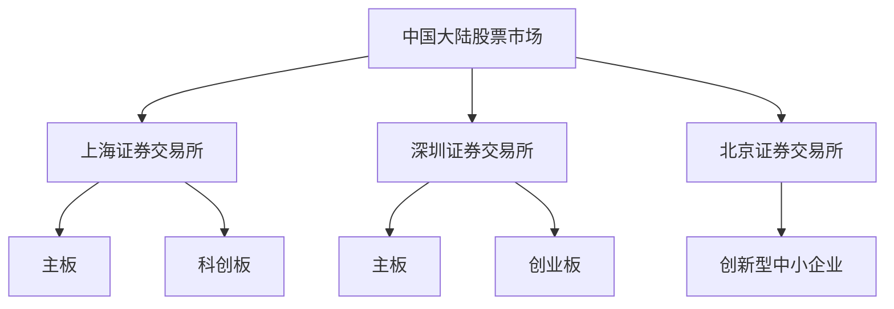
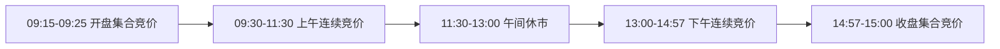
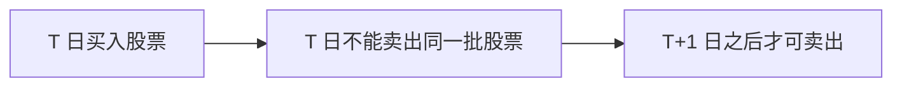
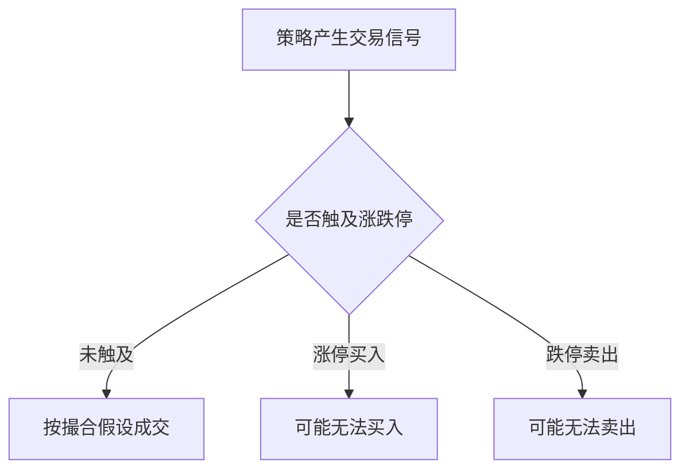
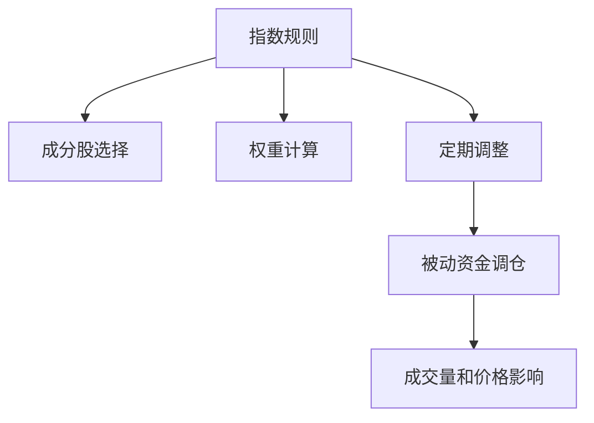

# 13 - 中国大陆股票市场

本章目标：理解中国大陆股票市场的基本结构、交易制度、数据特点和量化研究注意事项。这里重点讨论 A 股市场，也会顺带说明与 B 股、北交所、沪深港通相关的概念。

## 1. 一句话理解 A 股市场

A 股市场可以理解为：以人民币计价、在中国大陆证券交易所上市交易的股票市场。

对量化研究来说，A 股最重要的特点不是“公司很多”，而是交易制度和市场结构很有特色：

```text
T+1 交易
涨跌幅限制
午间休市
散户参与度较高
停牌和复牌需要处理
财报和公告时间戳很重要
指数成分和 ST 状态变化会影响回测
```

## 2. 市场结构

中国大陆股票市场主要由上海证券交易所、深圳证券交易所和北京证券交易所组成。



三个交易所的定位不同：

| 市场 | 大致定位 | 常见研究重点 |
|---|---|---|
| 上交所主板 | 大型企业、传统行业、蓝筹公司较多 | 大盘股、金融、周期、红利、指数增强 |
| 科创板 | 科技创新企业较集中 | 成长、研发、半导体、医药、科技主题 |
| 深交所主板 | 制造、消费、成长类公司较多 | 行业轮动、基本面、成长风格 |
| 创业板 | 创新成长企业较集中 | 高成长、高波动、估值和业绩弹性 |
| 北交所 | 创新型中小企业 | 小市值、流动性、专精特新主题 |

这张地图的作用是提醒：不要把 A 股看成一个完全均质的市场。不同板块的公司类型、流动性、波动率和交易规则都可能不同。

## 3. 股票代码和市场识别

A 股常用股票代码有一定规律。

| 代码开头 | 常见含义 |
|---|---|
| 600、601、603、605 | 上交所主板股票 |
| 688 | 科创板股票 |
| 000、001 | 深交所主板股票 |
| 002 | 原中小板股票，现已并入深市主板体系 |
| 300 | 创业板股票 |
| 8、4 开头部分代码 | 北交所股票 |

代码规则对数据清洗很有用。拿到一批股票代码后，可以先根据代码判断大致市场，再决定涨跌幅、交易规则和数据字段如何处理。

## 4. 交易时间

A 股通常有集合竞价、连续竞价和收盘集合竞价。

以上交所和深交所股票交易为例：

```text
开盘集合竞价：09:15 - 09:25
连续竞价：09:30 - 11:30
午间休市：11:30 - 13:00
连续竞价：13:00 - 14:57
收盘集合竞价：14:57 - 15:00
```



量化回测要特别注意：如果策略使用当天收盘价产生信号，就不应该再假设当天收盘价可以成交。更稳妥的做法是下一交易日开盘或下一交易日某个可交易时段成交。

## 5. T+1 交易制度

A 股股票通常实行 T+1 回转交易：当天买入的股票，通常要到下一个交易日才能卖出。

这对策略影响很大。

例如，一个日内反转信号在其他市场可能当天买入当天卖出，但在 A 股股票上不能直接这样执行。回测时如果允许当天买入又当天卖出，就会高估策略可交易性。



T+1 会影响：

- 日内策略
- 止损策略
- 尾盘买入策略
- 高换手策略
- 事件驱动策略
- 跌停风险控制

## 6. 涨跌幅限制

A 股有涨跌幅限制，这是和美股、港股差异很大的地方。

常见规则可以概括为：

| 类型 | 常见涨跌幅限制 |
|---|---|
| 主板普通股票 | 10% |
| ST 或 *ST 股票 | 5% |
| 科创板、创业板普通股票 | 20% |
| 北交所股票 | 30% |
| 新股上市初期、复牌等特殊情况 | 可能不设常规涨跌幅限制或适用特别规则 |

涨跌幅限制对量化研究非常重要。

如果一只股票涨停，你想买可能买不到；如果一只股票跌停，你想卖可能卖不掉。回测里如果假设涨停可以买入、跌停可以卖出，结果会明显失真。



## 7. 集合竞价和连续竞价

A 股交易不是全天同一种撮合方式。

- **集合竞价**：把一段时间内的买卖订单集中起来，按规则形成一个成交价。
- **连续竞价**：订单持续进入交易系统，按照价格优先、时间优先等规则连续撮合。

开盘价和收盘价通常来自集合竞价，因此尾盘策略和开盘策略必须理解集合竞价机制。

一个常见误区是：看到 14:59 的价格，就以为一定能在 15:00 收盘价成交。实际收盘集合竞价会根据订单集中撮合，最终收盘价可能和 14:57 前后的连续竞价价格不同。

## 8. 交易单位和订单约束

A 股股票买入通常以“手”为单位，一手通常是 100 股。卖出时可能出现零股处理。

量化系统下单时要处理：

- 目标金额转换成股数。
- 股数向 100 股整数倍取整。
- 剩余零股如何处理。
- 资金不足时如何调整订单。
- 单笔订单是否过大。

例如，策略希望买入 10,000 元某股票，价格是 37 元，理论股数约 270 股。但买入通常要按 100 股整数倍处理，实际可能只能买 200 股或 300 股，取决于资金和规则。

## 9. 停牌、复牌和 ST

A 股研究必须处理停牌、复牌和 ST 状态。

- **停牌**：股票暂停交易，策略想买或卖都无法执行。
- **复牌**：恢复交易后可能出现较大波动。
- **ST / *ST**：通常表示公司存在特别风险，涨跌幅、流动性和退市风险都可能不同。

回测中如果忽略停牌，会出现“历史上可以卖出，但真实市场无法卖出”的问题。

ST 股票也不能简单当作普通股票处理。它们可能有更高尾部风险、更低流动性和更严格涨跌幅限制。

## 10. 指数和宽基工具

A 股常见宽基指数包括：

- 上证综指
- 沪深 300
- 中证 500
- 中证 1000
- 创业板指
- 科创 50
- 北证 50

指数不是一个抽象数字，而是一套选样和加权规则。指数成分调整会影响 ETF、指数基金和指数增强策略。



做指数增强或因子选股时，要使用历史成分，不能用当前成分回推过去，否则会产生幸存者偏差。

## 11. 沪深港通和外资流向

沪深港通让境外投资者可以通过香港交易所买卖部分 A 股，也让内地投资者可以通过港股通买卖部分港股。

对量化研究来说，北向资金常被用作资金流指标。

但使用这类数据时要注意：

- 它不是全部外资。
- 它覆盖的是互联互通范围内的股票。
- 节假日差异会导致交易日不一致。
- 资金流数据可能有口径差异。

北向资金可以作为观察变量，但不能机械地等同于“聪明钱”。

## 12. A 股的数据特点

A 股数据研究常见字段：

```text
价格
成交量
成交额
换手率
复权因子
停牌状态
涨跌停状态
ST 状态
行业分类
财务报表
公告日期
指数成分
融资融券余额
北向资金
```

必须特别注意：

- 复权处理是否正确。
- 财报使用公告日期，而不是报告期结束日。
- 股票池是否包含退市股票。
- 停牌期间如何处理收益率。
- 涨跌停时是否允许成交。
- 行业分类是否随时间变化。
- 指数成分是否使用历史版本。

## 13. 常见策略方向

A 股常见量化研究方向包括：

- 多因子选股
- 指数增强
- 行业轮动
- 事件驱动
- 动量和反转
- 打新和新股研究
- 可转债策略
- ETF 轮动
- 融资融券相关策略
- 北向资金相关研究

不同策略对制度的敏感度不同。高换手策略对交易成本敏感，事件驱动策略对公告时间敏感，指数增强策略对成分股和行业暴露敏感。

## 14. 常见误区

### 误区 1：用当前股票池回测过去

这会忽略已经退市或表现很差的股票，导致收益虚高。

### 误区 2：忽略涨跌停

涨停买不到、跌停卖不掉，是 A 股回测必须显式处理的问题。

### 误区 3：财报时间用错

财报覆盖的是报告期，但交易只能使用公告后已经公开的信息。用报告期结束日代替公告日，会引入未来函数。

### 误区 4：把所有板块规则当成一样

主板、科创板、创业板、北交所的涨跌幅、上市公司特征和流动性差异明显，不能简单混在一起研究。

## 15. 实践任务

1. 选 10 只 A 股，按代码判断所属交易所和板块。
2. 下载一只股票的历史行情，标记停牌日、涨停日和跌停日。
3. 比较“不考虑涨跌停”和“考虑涨跌停”的回测差异。
4. 找一份财报，记录报告期、公告日期和可用于交易的最早日期。
5. 用历史成分股构造一个指数股票池，观察和当前成分股回测的差异。
6. 选一个 ETF，观察它与指数之间的跟踪误差和成交活跃度。

## 参考资料

- Shanghai Stock Exchange: Trading Schedule - https://english.sse.com.cn/start/trading/schedule/
- Shanghai Stock Exchange: Trading Mechanism - https://english.sse.com.cn/start/trading/mechanism/
- Shenzhen Stock Exchange: Trading Overview - https://www.szse.cn/English/services/trading/tradOverview/index.html
- HKEX: Shanghai-Hong Kong Stock Connect - https://www.hkex.com.hk/Mutual-Market/Stock-Connect?sc_lang=en
