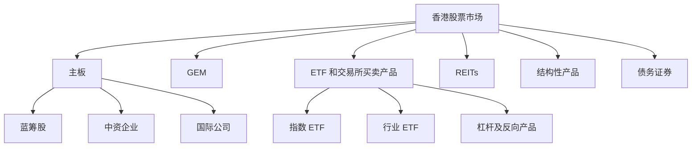
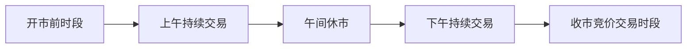
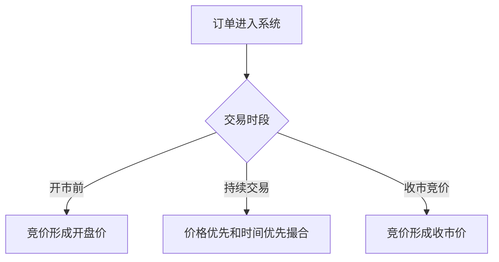
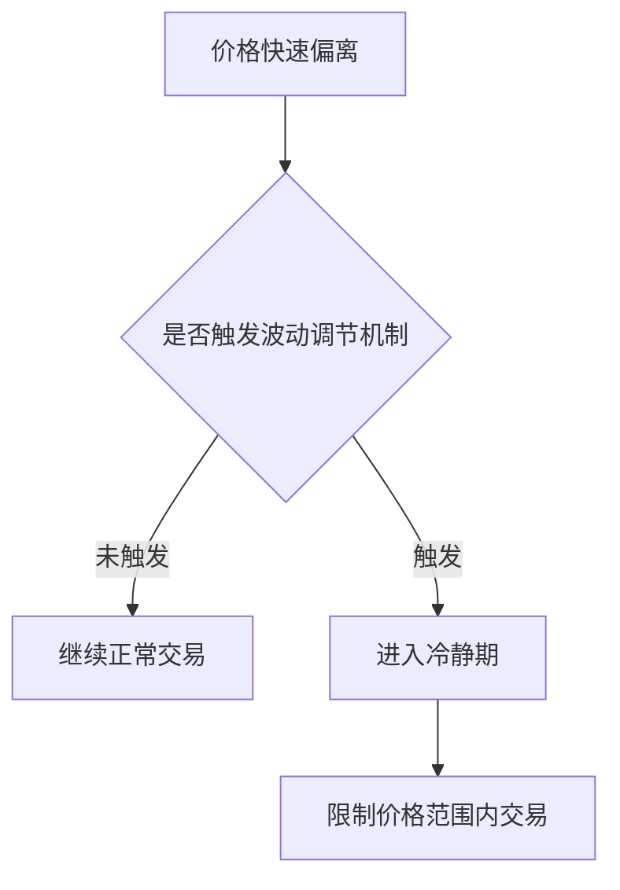
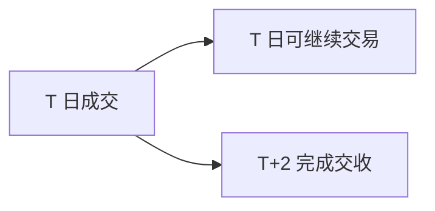
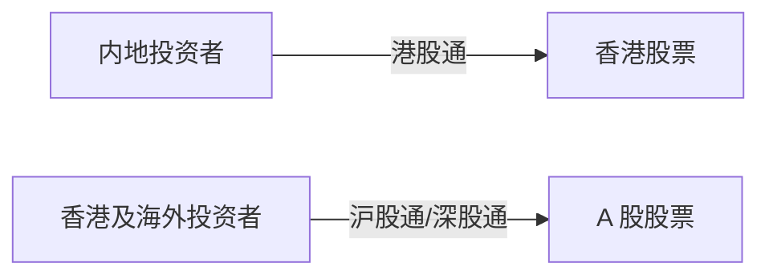

# 14 - 香港股票市场

本章目标：理解香港股票市场的基本结构、交易机制、产品类型、互联互通和量化研究注意事项。香港市场连接中国内地和国际资本，既有本地公司，也有大量中资公司和全球资金参与。

## 1. 一句话理解港股市场

港股市场可以理解为：以香港交易所为核心、以港币交易为主、连接内地企业和全球投资者的离岸股票市场。

它和 A 股、美股都不完全一样。

```text
没有 A 股式日常涨跌幅限制
允许日内买卖
有做空机制
有集合竞价和连续交易
有收市竞价交易时段
有大量中资股和国际资金
有港股通和沪深港通影响
```

对量化研究来说，港股最重要的是理解流动性差异、交易时段、做空限制、企业类型和资金结构。

## 2. 市场结构

港股市场的核心交易场所是香港交易所旗下证券市场。



主板通常聚集规模较大、流动性较好的公司。GEM 更偏向成长型企业，流动性和波动可能更明显。

港股还有大量衍生和结构性产品，例如窝轮、牛熊证、杠杆及反向产品。这些产品不是普通股票，价格结构和风险更复杂。

## 3. 港股公司的常见类型

港股市场里，公司来源很丰富。

| 类型 | 说明 | 研究重点 |
|---|---|---|
| 本地香港公司 | 业务主要在香港或周边地区 | 地产、公用事业、金融、消费 |
| H 股 | 内地注册、香港上市的公司 | 与 A 股同业、政策、汇率、估值差 |
| 红筹股 | 通常由中资背景控制、境外注册 | 中资背景、行业属性、控股结构 |
| 民营中资股 | 内地业务为主，香港上市 | 互联网、消费、医药、科技 |
| 国际公司 | 在港上市但业务全球化 | 流动性、投资者结构、汇率影响 |

港股研究不能只看股票代码，还要理解公司业务在哪里、收入货币是什么、主要投资者是谁、是否有 A 股对应标的。

## 4. 交易时段

港股交易由开市前时段、持续交易时段和收市竞价交易时段组成。典型结构如下：



常见时间结构可以理解为：

```text
开市前时段：用于形成开盘价
上午持续交易：连续撮合
午间休市：市场暂停连续交易
下午持续交易：连续撮合
收市竞价交易时段：部分证券通过竞价形成收市价
```

量化研究要注意：开盘价、盘中成交价和收盘价来自不同机制。使用收盘价产生信号时，不能假设自己一定可以在同一个收盘价成交。

## 5. 订单驱动市场和竞价机制

港股证券市场是订单驱动市场。买卖盘进入交易系统后，按照规则撮合。

核心机制包括：

- 开市前竞价
- 持续交易
- 收市竞价
- 价格优先
- 时间优先
- 不同订单类型



港股在开市前和收市竞价时段只接受特定竞价订单类型；持续交易时段则使用限价、增强限价、特别限价等订单类型。

## 6. 没有日常涨跌幅限制，但有波动调节机制

港股不像 A 股那样对普通股票普遍设置每日 10%、20% 或 30% 的涨跌幅限制。

但这不代表价格可以完全无约束地异常波动。港交所设有市场波动调节机制，用于部分证券在特定时段防止由闪崩、算法错误等交易事故引发的极端波动。



量化研究要区分两件事：

```text
没有日常涨跌幅限制
不等于没有市场稳定机制
```

极端行情下，港股可能出现较大跳空和快速波动。风控不能照搬 A 股涨跌停逻辑。

## 7. T+0 交易和 T+2 交收

港股允许日内买卖。也就是说，同一只股票可以当天买入后当天卖出。

但交易和交收不是一回事。港股证券市场通常采用 T+2 交收安排。



对策略来说，这意味着：

- 日内交易在制度上可行。
- 资金和证券交收仍有时间差。
- 实盘系统要区分可交易持仓、已成交持仓和已交收资产。

## 8. 做空机制

港股允许符合条件的证券进行受监管的卖空。

做空机制使港股可以研究更多双边策略：

- 多空组合
- 市场中性
- 配对交易
- 事件驱动做空
- 因子多空组合

但做空不是简单地“看跌就卖”。必须考虑：

- 证券是否允许卖空。
- 能否借到券。
- 借券成本是多少。
- 回补风险。
- 极端上涨风险。
- 交易规则限制。

多空策略回测如果不加入借券可得性和借券成本，结果可能明显偏乐观。

## 9. 港股通和互联互通

沪深港通让内地和香港市场之间形成双向投资通道。



港股通对港股有几个重要影响：

- 增加部分港股的内地资金参与。
- 内地节假日会影响港股通交易安排。
- 港股通标的池变化会影响流动性和资金流。
- 南向资金可能成为重要观察变量。

但南向资金不是全部资金，也不能简单等同于“确定性买盘”。使用时要注意口径和覆盖范围。

## 10. 港股数据特点

港股数据研究常见字段包括：

```text
价格
成交量
成交额
买卖价差
每手股数
停牌状态
复牌状态
公司公告
派息和除权
港股通标的状态
南向资金
卖空成交
行业分类
指数成分
```

港股特别需要注意“每手股数”。不同股票每手数量可能不同，不能像 A 股那样默认 100 股一手。

另一个重点是流动性。港股市场头部公司成交活跃，但不少中小股票成交稀疏。回测时必须考虑成交额、买卖价差和冲击成本。

## 11. 常见策略方向

港股常见量化研究方向包括：

- 中资股估值修复
- AH 股溢价和价差
- 港股通资金流
- 高股息和红利策略
- 行业轮动
- 互联网平台公司研究
- 多空因子组合
- 事件驱动
- 卖空数据研究
- ETF 和恒生指数相关策略

其中 AH 股研究需要同时理解 A 股和港股规则。两地价格差异可能来自交易制度、投资者结构、流动性、汇率、税费和资金通道限制，而不一定是简单套利机会。

## 12. 常见误区

### 误区 1：把港股当成没有限制的 A 股

港股没有 A 股式普遍涨跌幅限制，也允许日内买卖，交易逻辑和风险控制不能照搬 A 股。

### 误区 2：忽略流动性差异

港股流动性分布很不均衡。头部股票流动性好，不代表所有港股都容易成交。

### 误区 3：忽略每手股数

港股每手股数不统一，订单数量和资金分配必须按具体股票处理。

### 误区 4：把南向资金当成唯一变量

南向资金很重要，但港股还有本地资金、国际资金、ETF、机构资金和衍生品资金影响。

### 误区 5：忽略汇率

港股以港币交易为主。对使用人民币或美元计价的账户来说，汇率变化会影响最终收益。

## 13. 实践任务

1. 选择 5 只港股，查看每手股数、成交额和买卖价差。
2. 找一只同时有 A 股和 H 股的公司，比较两地价格差异。
3. 观察一只港股通标的，记录南向资金变化和成交额变化。
4. 对比港股普通股票、ETF、窝轮和牛熊证的风险差异。
5. 选择一只流动性较差的股票，估算大额订单可能产生的冲击成本。
6. 找一只高股息港股，查看派息、除净日和股价调整。

## 参考资料

- HKEX: Trading Mechanism - https://www.hkex.com.hk/Services/Trading/Securities/Overview/Trading-Mechanism?sc_lang=en
- HKEX: Stock Connect - https://www.hkex.com.hk/Mutual-Market/Stock-Connect?sc_lang=en
- HKEX: Regulated Short Selling - https://www.hkex.com.hk/Services/Trading/Securities/Overview/Regulated-Short-Selling?sc_lang=en
- HKEX: Settlement - Securities - https://www.hkex.com.hk/Services/Clearing/Securities/Overview/Settlement-Securities?sc_lang=en
