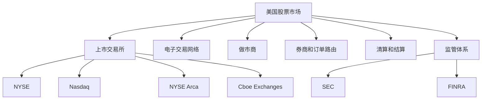
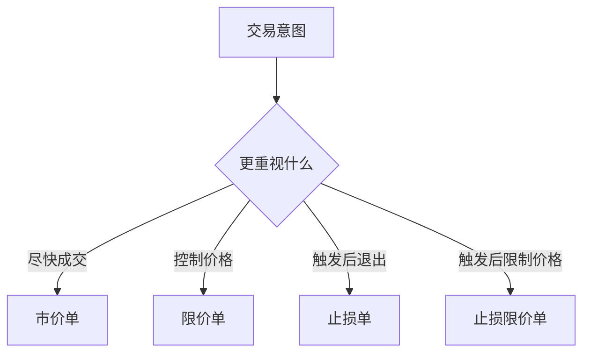
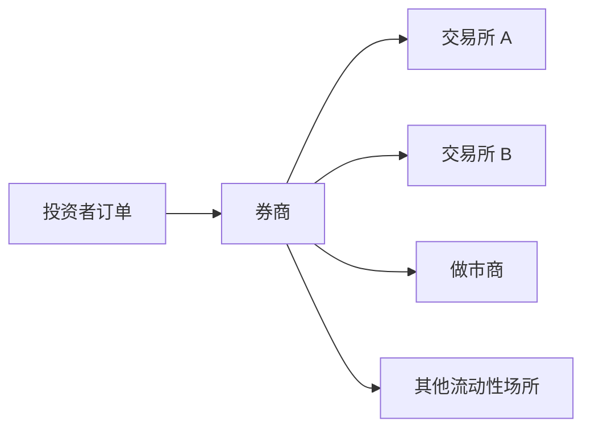
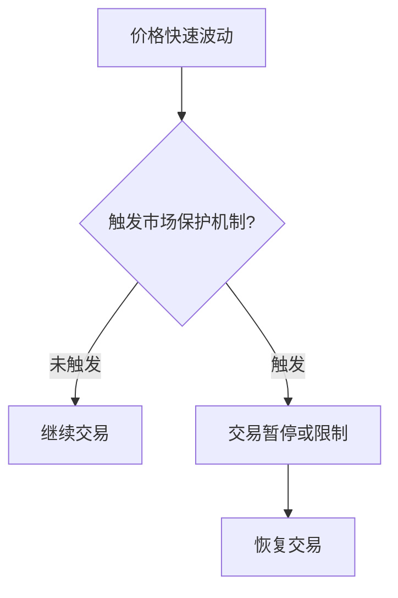

# 15 - 美国股票市场

本章目标：理解美国股票市场的基本结构、交易机制、订单类型、结算制度、市场数据和量化研究注意事项。美国市场是全球流动性最强、机构化程度最高、ETF 和衍生品生态最丰富的股票市场之一。

## 1. 一句话理解美股市场

美股市场可以理解为：由多个交易所、做市商、券商、清算机构和监管机构共同组成的全国性股票交易网络。

它和 A 股、港股都有明显差异：

```text
多交易所并存
美元计价
交易时间包含常规盘和盘前盘后
没有 A 股式日常涨跌幅限制
有市场级和个股级波动控制机制
可以日内买卖
卖空和融资融券体系成熟
ETF、ADR、期权生态发达
```

对量化研究来说，美股的重点不只是价格数据，而是市场结构、订单路由、成交质量、盘前盘后流动性、公司行为和 survivorship bias。

## 2. 市场结构

美国股票市场不是只有一个交易所。常见交易场所包括 NYSE、Nasdaq、NYSE Arca、Cboe 系列交易所等。



美国市场的一个重要特点是：同一只股票可能在多个交易场所成交。对于交易系统来说，看到一个价格并不代表只有一个市场，也不代表所有订单都走同一个交易所。

## 3. 主要股票类型

美股市场中的股票和权益类产品可以分成几类。

| 类型 | 说明 | 研究重点 |
|---|---|---|
| 普通股 | 公司所有权份额 | 基本面、估值、动量、行业、财报 |
| ETF | 交易所交易基金 | 指数跟踪、行业轮动、资产配置、流动性 |
| ADR | 外国公司在美国市场交易的存托凭证 | 汇率、母市场价格、跨市场价差 |
| REITs | 房地产投资信托 | 利率、分红、地产周期、现金流 |
| 优先股 | 兼具股票和债券特征 | 股息、利率、信用风险 |
| 封闭式基金 | 上市交易的基金结构 | 折溢价、流动性、分红 |

美股研究不能只看股票代码。不同产品的收益来源、税务、分红、交易时间、流动性和数据字段可能不同。

## 4. 交易时间

美股有常规交易时段，也有盘前和盘后交易。

以 NYSE 为例，核心交易时段通常是美国东部时间 09:30 到 16:00。NYSE 页面也列出部分市场的早盘和盘后交易安排。


常规盘流动性通常最好，买卖价差相对更小。盘前盘后交易流动性较弱，价格跳动更大，成交不确定性更高。

量化回测时，如果策略使用盘前或盘后价格，必须单独建模流动性、成交约束和滑点，不能直接套用常规盘假设。

## 5. 订单类型

美股常见订单类型包括市价单、限价单、止损单等。

- **市价单**：尽快成交，但成交价格不确定。
- **限价单**：设定可接受价格，但可能无法成交。
- **止损单**：价格触发后转为交易指令，用于控制亏损或保护利润。
- **止损限价单**：触发后按限价单执行，价格更可控，但可能无法成交。



订单类型会直接影响回测。一个策略如果假设每次都按最新价成交，通常会高估真实表现。

## 6. 多交易所和订单路由

美国股票市场是分散市场。一个股票可以在多个交易所和交易场所出现报价。

这带来几个关键概念：

- 最优买价和最优卖价
- 订单路由
- 做市商
- 成交质量
- 暗池和场外执行
- 支付订单流



量化研究通常不会在第一阶段深入模拟所有订单路由细节，但如果策略频率较高、成交要求较高，就必须关注买卖价差、盘口深度、成交质量和订单类型。

## 7. T+1 结算

美国证券市场的标准结算周期已经从 T+2 缩短为 T+1。简单说，大多数证券交易在交易日后的下一个工作日完成结算。


交易和结算是两回事。策略可能在 T 日成交，但资金和证券的最终交收需要按结算规则完成。实盘系统要区分：

```text
已下单
已成交
已结算
可用资金
可用持仓
```

这对现金账户、融资账户、频繁交易和跨资产组合都很重要。

## 8. 没有 A 股式日常涨跌幅限制，但有波动控制

美股普通股票没有 A 股那种普遍的每日 10%、20% 或 30% 涨跌幅限制。

但美股并不是没有波动控制。美国市场有市场级熔断机制，也有个股层面的 Limit Up-Limit Down 机制，用于防止价格在短时间内出现异常剧烈波动。



这意味着，美股回测不能使用 A 股涨跌停逻辑，但也不能假设极端行情下永远连续成交。

## 9. 卖空和融资融券

美股卖空和保证金交易体系较成熟，因此可以研究多空策略、市场中性策略、配对交易和因子多空组合。

但卖空不是免费的：

- 需要能借到股票。
- 需要支付借券成本。
- 可能遇到 hard-to-borrow 股票。
- 空头亏损理论上可能很大。
- 极端行情中可能被迫回补。
- 监管和券商规则可能影响执行。

多空策略回测如果不考虑借券成本、借券可得性和强制回补风险，会明显偏乐观。

## 10. ETF 和指数生态

美国 ETF 市场非常发达。常见 ETF 类型包括：

- 宽基指数 ETF
- 行业 ETF
- 债券 ETF
- 商品 ETF
- 杠杆 ETF
- 反向 ETF
- 主题 ETF
- 主动管理 ETF

ETF 适合量化研究，因为它们可以用于资产配置、行业轮动、风险对冲和跨资产策略。

但 ETF 也有风险：

- 跟踪误差
- 折溢价
- 流动性差异
- 结构复杂度
- 杠杆和反向产品的路径依赖

杠杆 ETF 和反向 ETF 不能简单按“指数倍数”长期持有理解。它们通常更适合短周期风险管理和交易研究。

## 11. 财报、公告和公司行为

美股数据研究高度依赖公司披露和公司行为处理。

常见事件：

- 10-K 年报
- 10-Q 季报
- 8-K 临时公告
- 分红
- 拆股
- 回购
- 并购
- 退市
- 股票增发

财报研究要注意：交易只能使用公告后已经可获得的信息。不能用报告期结束日代替真实披露时间。

公司行为会影响价格序列。如果不正确处理分红、拆股和退市，收益率、回撤和因子表现都会失真。

## 12. 美股数据特点

美股研究常见字段包括：

```text
价格
成交量
成交额
分红
拆股
复权因子
财报发布日期
SEC filing 时间
行业分类
指数成分
做空数据
期权数据
ETF 持仓
盘前盘后价格
```

必须特别注意：

- 是否包含退市股票。
- 是否使用 survivorship-free 数据。
- 是否正确处理拆股和分红。
- 财报和公告是否按发布时间对齐。
- 盘前盘后数据是否单独处理。
- ETF 和 ADR 是否使用了正确的标的映射。
- 行业分类和指数成分是否使用历史版本。

## 13. 常见策略方向

美股常见量化研究方向包括：

- 多因子选股
- 指数增强
- ETF 轮动
- 行业轮动
- 财报事件驱动
- 分析师预期变化
- 动量和反转
- 多空市场中性
- 期权波动率策略
- 并购和特殊事件
- ADR 跨市场研究

美股策略的优势是数据丰富、流动性强、产品多；难点是竞争激烈、市场结构复杂、交易成本和成交质量需要更精细建模。

## 14. 常见误区

### 误区 1：把美股等同于单一交易所

美股是多交易所、多流动性场所市场。同一只股票可能在多个地方有报价和成交。

### 误区 2：忽略盘前盘后风险

盘前盘后价格可能波动大、成交量低、价差宽，不能直接等同于常规盘价格。

### 误区 3：忽略退市股票

如果只使用当前仍上市的股票做历史回测，会产生幸存者偏差。

### 误区 4：忽略公司行为

拆股、分红、并购、退市、Ticker 变更都会影响数据。如果处理不当，收益率会明显失真。

### 误区 5：把卖空看成普通卖出

卖空涉及借券、保证金、借券成本和回补风险，不能在回测里当作免费操作。

## 15. 实践任务

1. 选 5 只美股，查看它们属于 NYSE、Nasdaq 还是其他交易场所。
2. 对比一只股票的常规盘成交量和盘前盘后成交量。
3. 找一个发生过拆股的股票，观察前复权和未复权价格差异。
4. 找一份 10-K 或 10-Q，记录报告期和提交时间。
5. 选择一个 ETF，查看跟踪指数、费用率、成交量和持仓。
6. 设计一个多空策略时，列出需要考虑的借券成本和风控限制。

## 参考资料

- NYSE: Holidays & Trading Hours - https://www.nyse.com/markets/hours-calendars
- SEC: T+1 Settlement Cycle Final Rules - https://www.sec.gov/newsroom/press-releases/2023-29
- Investor.gov: Stocks - https://www.investor.gov/introduction-investing/investing-basics/investment-products/stocks
- Investor.gov: Types of Orders - https://www.investor.gov/introduction-investing/investing-basics/how-stock-markets-work/types-orders
- Limit Up Limit Down Plan - https://www.luldplan.com/
- SEC EDGAR APIs - https://www.sec.gov/search-filings/edgar-application-programming-interfaces
